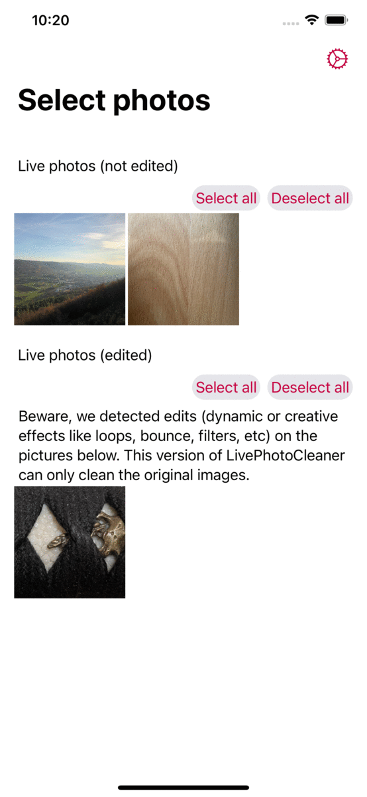

<table style="width: 100%; border: none">
<tr>
<td valign="top" style="width: 40%; border: none">

</td>
<td valign="top" style="border: none">

Live Photos are fantastic, but each picture weighs up to three times more than a still image. If you want to keep only the stills, that's a lot of wasted device memory.

With <strong>Live Photo Cleaner</strong>, you can delete the "Live" part of the picture and thus cut the size of the image by three, <strong>reclaiming precious megabytes</strong> of memory for each image you clean up.

<h4>Features</h4>
<ul>
<li>You can preview the memory that will be regained before cleaning up the photos</li>
<li>The still pictures remain linked with the albums they were added to.</li>
<li>Live Photos which were offloaded to iCloud are downloaded automatically.</li>
</ul>

<h4>Good to know</h4>
<ul>
<li>Live Photo Cleaner duplicates the Live Photo as a still picture, and moves the original to the "Recently Deleted" folder of the iOS Photos App. Thus memory will only be reclaimed after the photo is deleted for good.</li>
<li>The still pictures will appear as new pictures in the "Recents" album of the iOS Photos App. There is currently, no way around this, unfortunately.</li>
<li>Live Photos you edited (applied a bounce, loop, or long-exposure effect, applied a color filter, corrected exposure, cropped, etc.) cannot be cleaned up at the moment.</li>
</ul>

<h4>But most importantly</h4>

<ul>
<li>No in-app purchases</li>
<li>No ads</li>
<li>No need to unlock anything</li>
<li>We respect your privacy</li>
<li>Completely <a href="https://github.com/MATHEMA-GmbH/LivePhotoCleaner">open source</a></li>
</ul>

<h4>Download now</h4>

</td>
</tr>
</table>

Made with &#160;❤&#160; by <a href="https://www.mathema.de/">MATHEMA</a>

